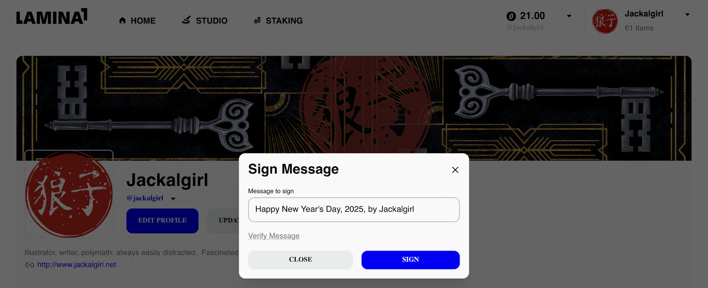

# Verifying Identity using Signed Messages in Lamina1
**_Why Signing a Message is Useful & How to Do It_**

The Lamina1 Hub supports a feature for signing messages, and for verifying signed messages.  Why might this be useful?

## Identify Verification
The primary use of signing a message is to prove that you are the account's owner.  If you have read the article "[The Importance of Seed/Mnemonic Phrases in Crypto/Blockchain](https://github.com/Jackalgirl/documentation/blob/main/seed-phrases.md)", you may recall that an account consists of two keys: the public key, which anyone can see[^1], and the private key, which is the key that the account's owner uses to authenticate a transaction (or signature).  Because the two keys are linked, a blockchain validator can verify, using the public key, that the transaction was submitted by someone who is in possession of the private key.  With a signed message, you can prove to someone else that you are the owner of your account and, vice versa, they can prove to you that they are the owner of their account.

## When Might this be Useful?
Imagine that someone is offering an NFT or other asset for sale Over the Counter (OTC): this means that they are not using a marketplace or other system designed specially for buying and selling assets.  Instead, they're simply saying, "I have this asset for sale, pay me xL1 and I will transfer it to you," and are typically making the arrangement for this one-on-one with a prospective buyer, either in public or in private.  

This obviously requires a significant amount of trust.  Not only do you, as a potential buyer, have to trust that they will in fact send you the asset once you send them the payment, but you have to trust that they actually have the asset in the first place.

For NFTs in particular: if you are looking at the item's listing in the Lamina1 Hub, you can see its owner.  Take, for example, the FujiKnight NFT, here: 


_(see this item on the Hub, directly, here: https://lamina1.com/item/0xab4d-fcb8c7-44937851760156022634111755770988795508464617439675138338516243802549346445721)_

If you look at this item, you can see that it is currently owned by Jackalgirl.  Let's say, for example, that Jackalgirl (or someone claiming to be Jackalgirl) claims that they are conducting an OTC sale of this NFT.  One of the things you could do, as a potential buyer, is ask the seller to send you a signed message.  You will be able to verify that this message was signed (or not) by the Jackalgirl account on the Hub; if you can verify it, then you know you are talking to Jackalgirl.  Whether or not she will actually send you the NFT if you pay her is another matter, but at least you know that it's her.[^2]

## How to Sign a Message

First, agree on the _plaintext_ of the message to be signed.  In order to verify a signed message, you must have the _exact_ plaintext message, so take care to select something that isn't potentially ambiguous.

Next, you'll go to the Hub and click on the "Sign Message" icon, which you can find by opening up your details using the triangle next to your account balance.  The icon look like a little scribble of handwriting, and if you hover over it, you will see the "Sign Message" tooltip:


A modal will appear, and you can input your plaintext and click "sign" to sign the message.



::: **Important!** Watch out for leading or trailing blank spaces in your plaintext, as this will change the signature, and if someone checking your message doesn't include the blank space(s), the message will not verify. :::

Once you have clicked "sign", you will see something like the following, which is a hashed version of your plaintext message created using your private key, which is referred to as the **signature**:


You can use the "copy to clipboard" icon (the two overlapping squares) to copy this message to your clipboard so that you can provide it to anyone who needs to verify the message.

## How to Verify a Message

Before you can verify a message, you will need three pieces of information:
o The _exact plaintext_ message that was signed.
o The signature (that is, the hash of the signed message).
o The alphanumeric (aka "c-chain") address of the signer.

::: **Important!** Your plaintext copy of the message must match the original plaintext signed message exactly, or the verification will fail! :::

To get a user's alphanumeric address, go to their profile on Lamina1: `https://lamina1.com/profile/[user's Lamina1 username]`

For example, here is the profile page of `@Jackalgirl`:


If you click on the small triangle to the right of the user's name, you will see a pop-up like the one shown in the screenshot above, which will allow you to copy either the user's username or their alphanumeric address to your clipboar.

Next, go to https://lamina1.com/sign to access all signing/verification functions (this is the page that the "verify message" link in the "sign message" modal will take you to).  You'll see that you can sign a message at the top of the page, but scroll down to get to the verification section, where you will fill in
o "Address to verify": The signer's alphanumeric address
o "Message to verify": the original plaintext message
o "Signature": the signature (the hash of the signed message)


Click "Verify" to verify the message.  If it successfull, you will see a "Message signature successfully verified!" response under the "Verify" button, like this:


A failure, however, will return a "Message signature verification failed" error:


Note the issue: the word "an" in the original plaintext has been misspelled.  This results in a different signature (hashed message), one that does not match the provided signature, so the verification has failed.  

::: If you are trying to verify a message and verification failed, check your plaintext and make sure that you have spelled everything correctly, and that there are no extra spaces, hidden characters, etc., in the text.  The plaintext must match the original message **exactly** in order for this process to work. :::

## Try It Yourself!

Here are the key pieces of the information used in this article.  You can use this information at https://lamina1.com/sign to verify this message yourself:

**Address to verify:** ```bash
0x3e0fe0Ee1BF683F60e1193768C9283DCA7469DD8```
**Message to verify:** ```bash
Here is an example of a test message```
**Signature:** ```bash
0x2d94482abc631fbf2a165f186f326cdbecf3de36bb2a8f5fe76778ffca55cb252ea3a549ea5dd5e0e8c38d4077c337a56cf41b4ae695ed41d049db3e52961eb21b```

[^1]: The alphanumeric, or "c-chain" address that you see -- the one that starts with "0x" and is a mixture of letters and numbers -- is actually a shorter string of characters _derived_ from the longer public key.
[^2]: Or it's someone who has access to her private key.  You see, the network has no way of distinguishing between the real Jackalgirl and, say, a scammer to whom she has foolishly given her private key or the mnemonic phrase that she used to create her account, because that's the whole point of blockchain: to enable you to execute transactions trustlessly, without requiring identification (the private key _is_ the identification).  So even if you have a signed message, it's important to keep this in mind.  For more on public/private keys, see "[The Importance of Seed/Mnemonic Phrases in Crypto/Blockchain](https://github.com/Jackalgirl/documentation/blob/main/seed-phrases.md)" and "[Common Scams in the Blockchain Industry](https://github.com/Jackalgirl/documentation/blob/main/scams.md)".
